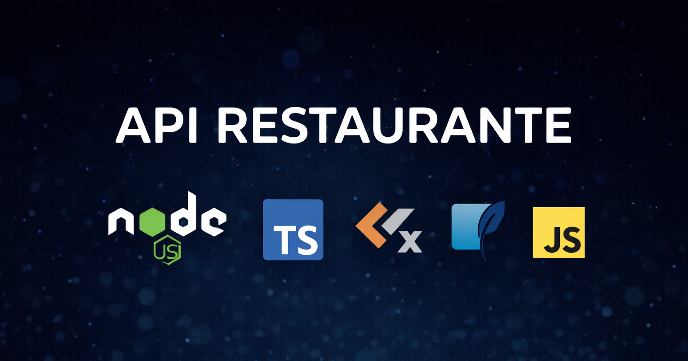

  

# 🍽️ API Restaurante

API REST desenvolvida com Node.js e TypeScript, utilizando arquitetura organizada em camadas, migrations com Knex e validação de dados. Projeto focado em boas práticas, escalabilidade e clareza de código.
