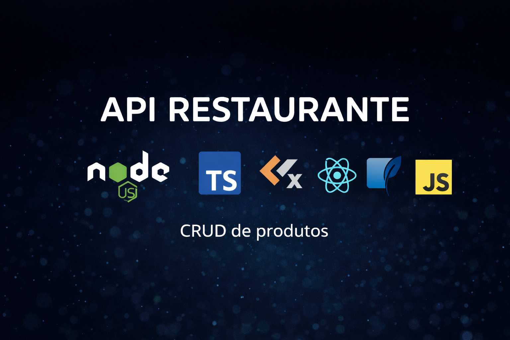

<p align="center">
  
</p>

# 🍽️ API Restaurante

API REST para gerenciamento de produtos de restaurante, desenvolvida com foco em organização de código, boas práticas e arquitetura escalável.

---

## 🚀 Stack

- Node.js
- JavaScript
- TypeScript
- Express
- Knex.js
- SQLite

---

## ⚙️ Funcionalidades

- CRUD de produtos
- Migrations com Knex
- Validação de dados
- Arquitetura em camadas (routes, controllers, middlewares)

---

## 🔗 Rotas principais

- **POST** `/products` – Criar produto  
- **GET** `/products` – Listar produtos  
- **PUT** `/products/:id` – Atualizar produto  
- **DELETE** `/products/:id` – Remover produto  

---

## ▶️ Como executar

```bash
npm install
npm run knex -- migrate:latest
npm run dev


